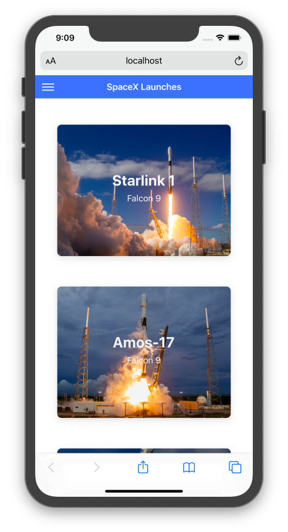

# ionic-react-graphql
An app with GraphQL SpaceX API, Ionic and React



## Getting Started

```bash
# Get the latest snapshot
$ git clone --depth=1 https://github.com/pinceladasdaweb/ionic-react-graphql.git
```

Copy the content of file .env.example to .env file

## How to run

```bash
# Run in the terminal
$ ionic serve
```
